# Automating Evaluation Notifications in Amazon Connect

---

## Introduction

Agent evaluations are often a large component of contact center quality assurance. By regularly reviewing agent interactions, supervisors can help achieve compliance with company policies, improve customer satisfaction, and identify opportunities for coaching and development. However, distributing evaluation results to the right supervisors and managers can be challenging, especially in organizations with complex hierarchies. Manual notification processes are time-consuming, error-prone, and can lead to delays in feedback delivery—impacting agent performance and slowing down improvement cycles.

In this guide, we will show you how to implement an automated, hierarchy-aware evaluation notification system for Amazon Connect. This solution will allow evaluators to select which role they want to notify directly within the agent evaluation form. By following this walkthrough, you can adapt the solution to fit your own contact center’s needs and streamline your evaluation feedback process.

## Overview of Solution

This solution automates the notification process for completed agent evaluations in Amazon Connect. The solution creates an evaluation form that includes a trigger question allowing evaluators to select which role should be notified. When an evaluation is submitted and stored in Amazon Simple Storage Service (Amazon S3), an AWS Lambda function is triggered. The AWS Lambda function retrieves the evaluation data, determines the appropriate recipients by traversing the agent’s hierarchy and role tags in Amazon Connect, and sends personalized email notifications to the recipients using Amazon Simple Email Service (Amazon SES).

## How it Works

1. **Evaluator completes evaluation and selects a role to notify**
   - Quality assurance team completes agent evaluation form
   - Selects "Supervisor", "Manager", or other roles from notification dropdown

2. **Evaluation results stored in Amazon S3**
   - Amazon Connect automatically saves evaluation data to Amazon S3 bucket
   - JSON file contains evaluation details and selected notification role

3. **Amazon S3 Event triggers AWS Lambda Function**
   - Amazon S3 bucket notification configured to invoke AWS Lambda on new evaluation files
   - AWS Lambda function receives Amazon S3 event with evaluation file details

4. **AWS Lambda function processes the evaluation:**
   - **Looks up evaluated agent's organization** in Connect's agent hierarchy
   - **Checks which role to notify** based on selected role and user tags
   - **Gathers email addresses** from Connect user profiles
   - **Sends email notification** to filtered users via Amazon SES

## Prerequisites

Before you begin, ensure you have the following:

- **An AWS account** with permissions to create and manage AWS Lambda, Amazon S3, SES, and IAM resources.
- **An Amazon Connect instance** with agent hierarchy and role tags configured.
- **An Amazon S3 bucket** for storing completed evaluation results.
- **Amazon SES** configured with:
  - Verified sender email address or domain
  - SES sending quota sufficient for notification volume
  - SES permissions: `ses:SendEmail`, `ses:SendRawEmail`
- **IAM roles and policies** that grant AWS Lambda the following specific permissions:
  - **Amazon S3**: `s3:GetObject` on the evaluation results bucket
  - **SES**: `ses:SendEmail`, `ses:SendRawEmail` 
  - **Amazon Connect**: `connect:DescribeUser`, `connect:SearchUsers`, `connect:DescribeInstance`
  - **CloudWatch Logs**: `logs:CreateLogGroup`, `logs:CreateLogStream`, `logs:PutLogEvents`

## Deploy the solution

### A. CloudFormation deployment

**Before deploying, gather these values from your Amazon Connect instance:**

1. **Instance ARN**: Go to Amazon Connect console → Instances → Click your instance name → Copy the Instance ARN
2. **Amazon S3 Bucket and Location**: Go to Amazon Connect console → Your instance → Data storage → Contact evaluations
   - **ConnectEvaluationBucket**: Just the bucket name (e.g., `myconnectinstance`)
   - **ConnectEvaluationLocation**: The full path after the bucket name (e.g., `connect/myconnectinstance/ContactEvaluations`)
3. **SES Email**: A verified email address in Amazon SES that will send notifications

**Deploy the CloudFormation template:**

1. Download the zip file code for this repository [here](source/index.zip).
2. Create an Amazon S3 solution bucket within the same region where the Amazon Connect instance is located.
3. Upload the zip file downloaded in step one to the new bucket.
4. Run the CloudFormation Template located [here](cft/amazon-connect-automated-evaluation-notification.yaml).
5. Following parameters needed for the CloudFormation Template:
   - **AssetsBucketName**: Amazon S3 Bucket created in step two
   - **ConnectInstanceArn**: ARN of the Amazon Connect instance
   - **ConnectEvaluationBucket**: Amazon S3 bucket **name** where evaluations are stored
   - **ConnectEvaluationLocation**: Amazon S3 prefix for evaluation files
   - **SESEmail**: Verified email address for sending notifications
   - **EmailFieldSource**: Connect user field for email addresses
     - Username (typically for SSO enabled instances)
     - Email
     - Secondary Email (also used for Contact Lens Rules notifications)
   - **UseHierarchyforNotification**: Configures whether hiearchy will be used in the agent filter. If "No" is selected, then only the *role* tag will be used to filter email recipients.

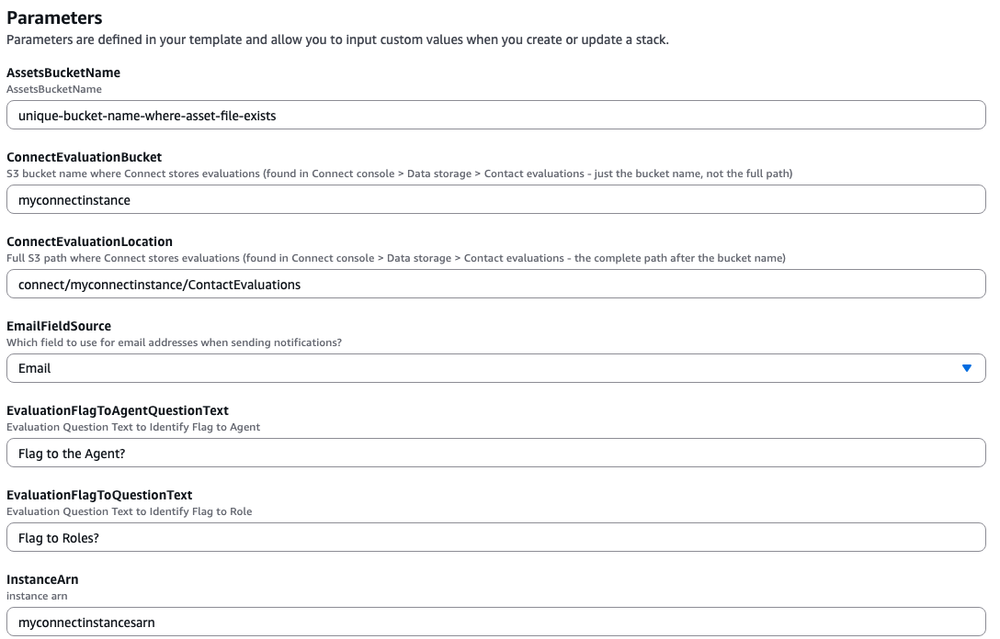
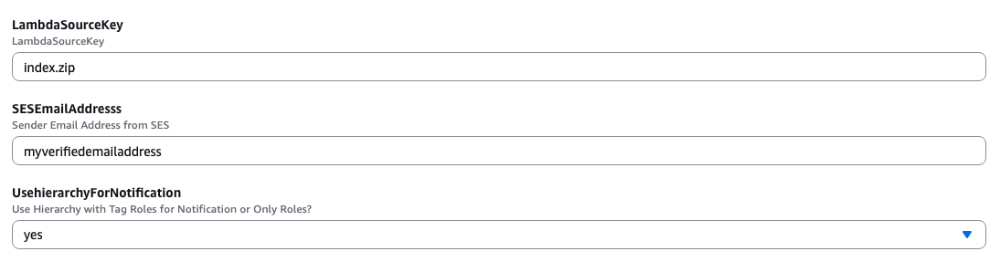

### B. Create users in your Amazon Connect Instance

For this walkthrough create users using the hierarchy branch example: Earth/NorthAmerica/USA/Washington/Seattle. Use the tag key `role` with values `agent`, `supervisor`, or `manager`.

1. Users to create
   - evalAgentA
     - Username: evalAgentA
     - Hierarchy group: Earth/NorthAmerica/USA/Washington/Seattle
     - Tags: role:agent
   - evalAgentB
     - Username: evalAgentB
     - Hierarchy group: Earth/NorthAmerica/USA/Washington/Bellevue
     - Tags: role:agent
   - evalSupervisor
     - Username: evalSupervisor
     - Hierarchy group: Earth/NorthAmerica/USA/Washington/Seattle
     - Tags: role:supervisor
   - evalManager
     - Username: evalManager
     - Hierarchy group: Earth/NorthAmerica/USA/Washington/Seattle
     - Tags: role:manager

Provide emails to the evalSupervisor and evalManager using the primary ***Email Address*** field.

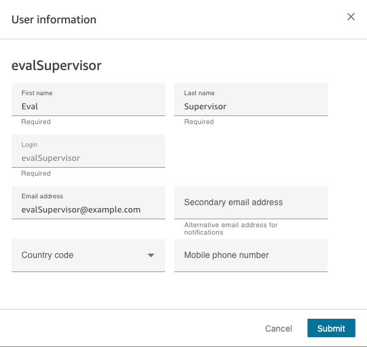

2. Verification
   - Confirm users appear in the correct hierarchy group in the Connect console.
   - Confirm the `role` tag exists (console or ListTags API).
   - Record exact Username/Email values — the AWS Lambda uses these as SES recipients.

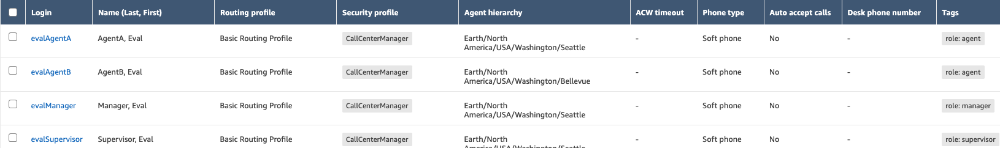

Notes
- evalAgentA, evalSupervisor, and evalManager share the same hierarchy to demonstrate hierarchy-based routing. 
- Keep the `role` tag key/value consistent so the AWS Lambda search logic can reliably filter recipients.

### C. Activate the Evaluation Form

The CloudFormation deployment automatically creates an evaluation form called "Evaluation Notification Form" with the required notification role selection question. You need to activate it to make it available for use.

1. **Navigate to Evaluation Forms**
   - Go to Amazon Connect Admin Console
   - Navigate to **Analytics and optimization** → **Evaluation forms**

2. **Activate the Form**
   - Find "Evaluation Notification Form" in the list
   - Click on **Version 1** to open it
  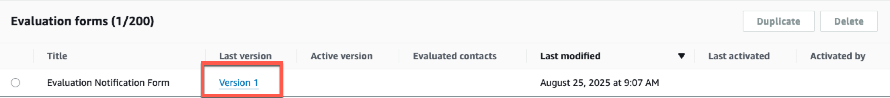
   - Scroll down to observe section **Notification Questions**
   - Expand the selection **Which role should be notified?** (or whichever question you selected to use on the Evaluation Form)
   - Selection the checkbox to make this question Optional.
   - 
   - Click **Activate** to make it available for use
   - 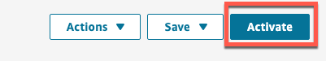
   - Confirm activation 

The form includes a "Which role should be notified?" question with role options, which the notification AWS Lambda uses to determine recipients.

**Important:** This exact question text can be added to any other evaluation form to enable notifications. The question text must match exactly as configured during deployment. You can customize the answer options based on your role tag structure - just ensure the answer options match the 'role' tags assigned to your Connect users.

**Note:** Agent notifications can be configured separately using Contact Lens rules when an evaluation is performed on them.

### D. Test the Solution by Submitting an Evaluation Form

Now that you've deployed the solution and activated the evaluation form, let's test the automated notification system by submitting an evaluation.

> :memo: **Note:** Before testing the solution, you will have to route a contact to evalAgentA. This can be performed by simply logging into the Agent Desktop as evalAgentA and performing an outbound call.

1. **Navigate to Contact Search**
   - In the Amazon Connect Admin Console, go to **Analytics and optimization** → **Contact search**
   - Search for a contact that has been connected to test agent **evalAgentA**
   - Select a completed contact from the search results

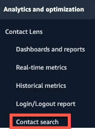

2. **Access the Contact Details**
   - Click on the contact to open the Contact details page
   - On the Contact details page, choose **Evaluations** or click the **<** icon to open the evaluations panel

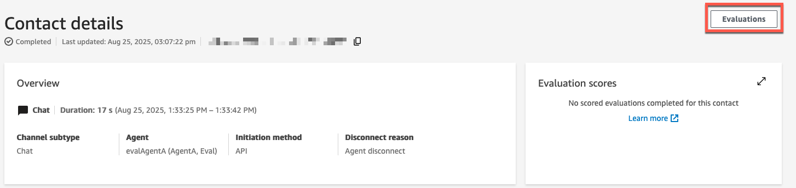

3. **Start a New Evaluation**
   - In the Evaluations panel, click the dropdown menu to select an evaluation form
   - Choose **Evaluation Notification Form** (the form created by the CloudFormation deployment)
   - Click **Start evaluation**

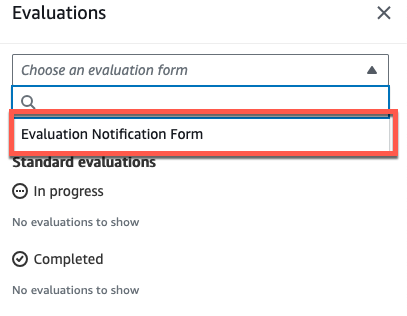

4. **Complete the Evaluation Form**
   - Fill out the evaluation questions as needed
   - When you reach the "Which role should be notified?" question, select **Supervisor**
   - Complete any remaining required fields
   - Click **Submit** to finalize the evaluation

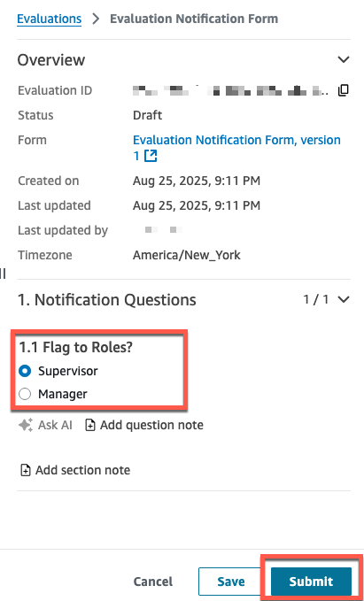

5. **Verify Email Notification**
   - Check the email inbox for the evalSupervisor user
   - You should receive an automated email notification about the completed evaluation
   - The email will contain details about the evaluated agent and evaluation results

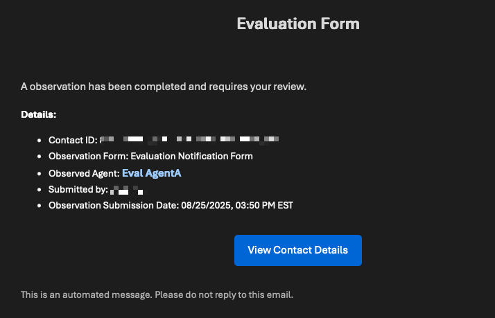

6. **Test Different Notification Roles** (Optional)
   - Repeat the process with another contact
   - This time, select **Manager** for the notification role
   - Verify that the evalManager user receives the notification email

### Expected Results:

**Example 1: Evaluating evalAgentA (Seattle hierarchy)**
- When evaluating **evalAgentA** (hierarchy: Earth/NorthAmerica/USA/Washington/Seattle)
- Select "Supervisor" as the role to notify
- **Result**: evalSupervisor receives an email notification (same hierarchy + supervisor role tag)

**Example 2: Evaluating evalAgentA with Manager notification**
- When evaluating **evalAgentA** (hierarchy: Earth/NorthAmerica/USA/Washington/Seattle)
- Select "Manager" as the role to notify
- **Result**: evalManager receives an email notification (same hierarchy + manager role tag)

**Example 3: Evaluating evalAgentB (Bellevue hierarchy)**
- When evaluating **evalAgentB** (hierarchy: Earth/NorthAmerica/USA/Washington/Bellevue)
- Select "Supervisor" as the role to notify
- **Result**: No email sent - no supervisors exist in the Bellevue hierarchy

The system only notifies users who are in the same hierarchy branch as the evaluated agent AND have the selected role tag.

**Troubleshooting:**
- If no email is received, check the CloudWatch logs for the AWS Lambda function
- Verify SES identities and quotas using commands in SES Requirements section
- Ensure the Connect user has a valid email address in the configured email field
- Confirm that the user tags are correctly set with `role=supervisor` or `role=manager`

### Cleaning Up

To avoid incurring future charges, remove all created resources by <a href="https://docs.aws.amazon.com/AWSCloudFormation/latest/UserGuide/cfn-console-delete-stack.html" target="">deleting the AWS CloudFormation stack.</a>

## Conclusion

This solution demonstrates Amazon Connect's powerful interoperability with core AWS services to create scalable, automated workflows. By leveraging **Amazon S3** for data storage, **AWS Lambda** for serverless processing, **SES** for reliable email delivery, and **CloudFormation** for infrastructure as code, we've built a robust evaluation notification system that scales with your contact center's growth.

The hierarchy-aware notification logic ensures the right stakeholders receive timely feedback, while the serverless architecture eliminates infrastructure management overhead.

